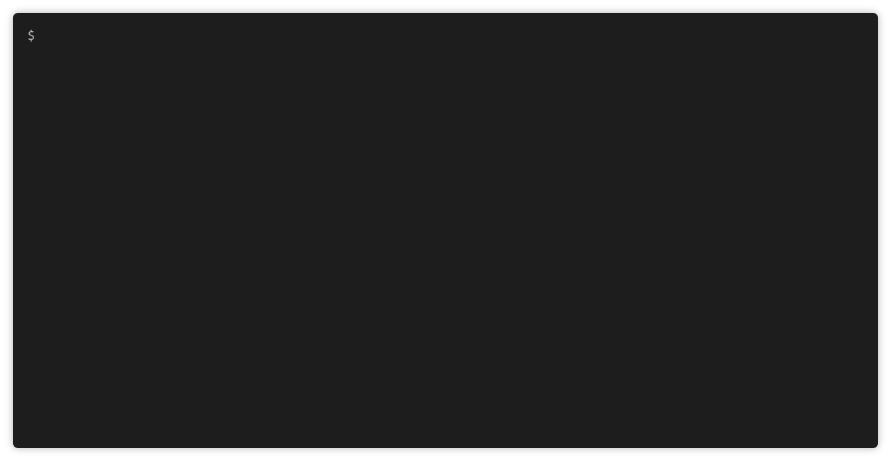

# AuthCov
[](https://badge.fury.io/js/authcov)

Web app authorisation coverage scanning.



## Introduction

AuthCov crawls your web application using a Chrome headless browser while logged in as a pre-defined user. It intercepts and logs API requests as well as pages loaded during the crawling phase. In the next phase it logs in under a different user account, the "intruder", and attempts to access each of one of the API requests or pages discovered previously. It repeats this step for each intruder user defined. Finally it generates a detailed report listing the resources discovered and whether or not they are accessible to the intruder users.

An example report generated from scanning a local Wordpress instance:
[](https://authcov.github.io/example_report/index.html)

## Features
- Works with single-page-applications and traditional multi-page-applications
- Handles token-based and cookie-based authentication mechanisms
- Generates an in-depth report in HTML format
- Screenshots of each page crawled can be viewed in the report

## Installation

Install the latest node version. Then run:

```bash
$ npm install -g authcov
```

## Usage

1. Generate a config for the site you want to scan [NOTE: It has to end in `.mjs` extension]:
```bash
$ authcov new myconfig.mjs
```
2. Update the values in myconfig.mjs
3. Test your configuration values by running this command to ensure the browser is logging in successfully.
```
$ authcov test-login myconfig.mjs --headless=false
```
4. Crawl your site:
```bash
$ authcov crawl myconfig.mjs
```
5. Attempt intrusion against the resources discovered during the crawling phase:
```bash
$ authcov intrude myconfig.mjs
```
6. View the generated report at: `./tmp/report/index.html`

## Configuration

The following options can be set in your config file:

| option | type | description |
| --- | --- | --- |
| baseUrl | string | The base URL of the site. This is where the crawler will start from.|
| crawlUser | object | The user to crawl the site under.  Example: `{"username": "admin", "password": "1234"}`|
| intruders | array | The users who will intrude on the api endpoints and pages discovered during the crawling phase. Generally these will be users the same or less privilege than the crawlUser. To intrude as a not-logged-in user, add a user with the username "Public" and password null.  Example: `[{"username": "john", "password": "4321"}, {"username": "Public", "password": null}]`|
| type | string | Is this a single-page-application (i.e. javascript frontend which queries an API backend) or a more "traditional" multi-page-application. (Choose `"mpa"` or `"spa"`). |
| authenticationType | string | Does the site authenticate users by using the cookies sent by the browser, or by a token sent in a request header? For an MPA this will almost always be set to `"cookie"`. In an SPA this could be either `"cookie"` or `"token"`. |
| authorisationHeaders | array | Which request headers are needed to be sent in order to authenticate a user? If authenticationType=cookie, then this should be set to `["cookie"]`. If authenticationType=token, then this will be something like: `["X-Auth-Token"]`. |
| maxDepth | integer | The maximum depth with which to crawl the site. Recommend starting at 1 and then try crawling at higher depths to make sure the crawler is able to finish fast enough. |
| verboseOutput | boolean | Log at a verbose level, useful for debugging. |
| saveResponses | boolean | Save the response bodies from API endpoints so you can view them in the report. |
| saveScreenshots | boolean | Save browser screenshots for the pages crawled so you can view them in the report. |
| clickButtons | boolean | (Experimental feature) on each page crawled, click all the buttons on that page and record any API requests made. Can be useful on sites which have lots of user interactions through modals, popups etc. |
| xhrTimeout | integer | How long to wait for XHR requests to complete while crawling each page. (seconds) |
| pageTimeout | integer | How long to wait for page to load while crawling. (seconds) |
| headless | boolean | Set this to false for the crawler to open a chrome browser so you can see the crawling happening live. |
| unAuthorizedStatusCodes | array | The HTTP response status codes that decide whether or not an API endpoint or page are authorized for the user requesting it. Optionally define a function responseIsAuthorised to determine if a request was authorized. Example: `[401, 403, 404]`|
| ignoreLinksIncluding | array | Do not crawl URLs containing any strings in this array. For example, if set to `["/logout"]` then the url: http://localhost:3000/logout will not be crawled. Optionally define a function ignoreLink(url) below to determine if a URL should be crawled or not. |
| ignoreAPIrequestsIncluding | array | Do not record API records made to URLs which contain any of the the strings in this array. Optionally define a function ignoreApiRequest(url) to determine if a request should be recorded or not. |
| ignoreButtonsIncluding | array | If clickButtons set to true, then do not click buttons who's outer HTML contains any of the strings in this array. Optionally define a function ignoreButton(url) below. |
| loginConfig | object | Configure how the browser will login to your web app. Optionally define an async function loginFunction(page, username, password). (More about this below). |
| cookiesTriggeringPage | string | (optional) when authenticationType=cookie, this will set a page so that the intruder will browse to this page and then capture the cookies from the browser. This can be useful if the site sets the path field on cookies. Defaults to options.baseUrl. |
| tokenTriggeringPage | string | (optional) when authenticationType=token, this will set a page so that the the intruder will browse to this page and then capture the authorisationHeaders from the intercepted API requests. This can be useful if the site's baseUrl does not make any API requests and so cannot capture the auth headers from that page. Defaults to options.baseUrl. |

**Configuring the Login**

There are two ways to configure the login in your config file:

1. Using the default login mechanism which uses puppeteer to enter the username and password into the specified inputs and then click the specified submit button. This can be configured by setting the `loginConfig` option in your config file like this. See this [example](https://github.com/authcov/authcov/blob/master/docs/examples/example-spa-config.js#L27-L32) too.
```js
"loginConfig": {
  "url": "http://localhost/login",
  "usernameXpath": "input[name=email]",
  "passwordXpath": "input[name=password]",
  "submitXpath": "#login-button"
}
```

2. If your login form is more complex and involves more user interaction then you can define your own puppeteer function in your config file like this. See this [example](https://github.com/authcov/authcov/blob/master/docs/examples/example-mpa-config.js#L25-L37) too.
```js
  "loginFunction": async function(page, username, password){
    await page.goto('http://localhost:3001/users/sign_in');
    await page.waitForSelector('input[type=email]');
    await page.waitForSelector('input[type=password]');

    await page.type('input[type=email]', username);
    await page.type('input[type=password]', password);

    await page.tap('input[type=submit]');
    await page.waitFor(500);

    return;
  }
```

Don't foget to run the `authcov test-login` command in headful mode in order to verify the browser logs in successfully.

## Contributing

Clone the repo and run `npm install`. Best to use node version 17.1.0.

**Unit Tests**

Unit tests:
```bash
$ npm test test/unit
```

**End2End tests:**

First download and run the [example app](https://github.com/evanrolfe/example_app). Then run the tests:
```bash
$ npm test test/e2e
```
